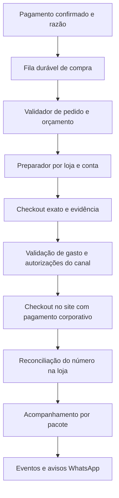

# Lia — revisão de código, negócio, compra e acompanhamento

> Continuação autorizada pelo dono: [implementação do comprador e acompanhamento](compra-e-acompanhamento-2026-09-06.md). Atualiza o estado das recomendações abaixo; código local implementado, ativação e homologação reais pendentes.

Data: 06/09/2026. Autor: Codex. Pedido: revisão em cinco frentes do dono.

**Estado da entrega: correções no repositório local; nenhuma publicação, compra, cobrança, mensagem real ou alteração da automação nesta revisão.** A migration nova foi exercitada em banco descartável. A arquitetura de compra autônoma e os conectores de rastreio descritos abaixo são proposta, salvo os componentes explicitamente marcados como implementados.

> **Decisão posterior do dono em 06/09:** não haverá loja parceira. A arquitetura e a estratégia abaixo foram revisadas para comprar como cliente nos sites existentes. Recomendações anteriores de parceria/API comercial foram retiradas.

## 1. Conclusão principal

A Lia já faz bastante bem a parte de conversar, encontrar opções, guardar preferências e cobrar. O principal problema está entre receber o dinheiro e obter a compra confirmada na loja. Depois disso, falta uma fonte confiável de acompanhamento. Mais inteligência no chat melhora a experiência, mas não elimina esses dois intervalos.

Minha recomendação é manter a proposta de compras pelo WhatsApp e concentrar a próxima fase em **uma operação pequena que complete pedidos repetidamente**, com poucas lojas homologadas, uma loja por pedido no primeiro fluxo automatizado e métricas financeiras reais. Não ampliar catálogo, agentes ou promessas de velocidade antes de fechar esse circuito. Isso é recomendação; não alterei a vitrine nem as regras comerciais existentes.

O destino desejado é: pagamento confirmado → trabalho de compra persistido → validação do checkout → pagamento operacional autorizado → número de compra reconciliado → acompanhamento por pacote → aviso ao cliente com recibo. O agendamento local passa a ser uma contingência.

## 2. O que foi examinado e limites da evidência

Revisão transversal do fluxo vivo: conversa e contexto, ranking e catálogo, simulação de frete/estoque, pagamentos e webhooks, razão e estornos, plano B, operação, worker, cron, autenticação das rotas alteradas, schema/migrations, testes, configuração da automação e documentação operacional/estratégica. Compilei a aplicação e rodei a suíte inteira em Postgres local, além de regressões dirigidas aos problemas encontrados.

Os catálogos gerados foram avaliados pelo código que os consome e pelos casos de busca; não homologuei individualmente todos os SKUs, preços ou checkouts de 18 lojas. Também não fiz pentest, conciliação bancária, auditoria fiscal, teste de carga ou um novo pedido real de ponta a ponta. “Revisão completa” aqui cobre as áreas do produto; não equivale a provar ausência de defeitos em todas as combinações.

### Medição somente leitura em produção

Consulta agregada às 10:18:50 UTC de 06/09, por `scripts/review-metrics.mts`, dentro de transação READ ONLY:

| Medida | Resultado |
|---|---:|
| Pedidos totais, incluindo testes/histórico | 466 |
| Pedidos com entrada no razão marcada como Mercado Pago/Pagar.me | 3 |
| Pagamentos nessas entradas | 3 |
| Valor registrado | R$ 63,54 |
| Valor de estorno registrado | R$ 24,14 |
| Estados desses pedidos | 1 preparando; 1 estornado; 1 pago |
| Com número de compra na loja | 1 |
| Com `deliveredAt` preenchido | 0 |
| Soma de taxas de serviço cotadas nesse recorte | R$ 2,60 |

Esse recorte **não mede todos os pagamentos históricos**, pois o razão foi introduzido recentemente. Não distingue dono de clientes externos e não prova liquidação no provedor. Ausência de `deliveredAt` não prova que ninguém recebeu: também mostra a insuficiência do acompanhamento. O cabeçalho dos três pedidos diz `concierge`; isso não identifica a loja dos itens. A taxa cotada não é lucro. Não usar 466 como clientes, vendas ou validação de demanda, nem transformar 3 registros em taxa de sucesso estatística.

A automação local está ativa e horária. Seu prompt já permite preparar carrinhos de outras lojas usando cartão corporativo previamente salvo, parando antes da confirmação financeira. A limitação encontrada é que **a fila durável existente só representava Mercado Livre**; a preparação informal nas outras lojas não tinha a mesma reserva/reconciliação. Não alterei essa rotina.

## 3. Correções implementadas

| Área | Problema encontrado | Correção local |
|---|---|---|
| Pagamento | Pedido podia virar pago e falhar ao registrar o dinheiro, com erro absorvido | Estado pago e razão gravados na mesma transação, com trava do pedido |
| Pagamento | Segundo pagamento de um pedido já pago podia desaparecer como replay | Identidade distinta vira pagamento inesperado, com o tratamento de exceção existente |
| Pagamento | Valor ausente/NaN podia escapar da validação | Exige identificação, valor finito positivo e igualdade em centavos nos caminhos com evidência |
| Pagamento | Falha tardia ao emitir/enviar cobrança podia sobrescrever um pedido já pago | Reversão condicionada ao estado de emissão/aguardo de pagamento |
| Razão | Replay de confirmação podia ressuscitar pagamento estornado | Replay preserva estorno e valida vínculo com pedido e valor |
| Estorno | Duas parcelas iguais usavam a mesma chave no provedor | Identidade inclui pagamento, saldo já devolvido e valor desta parcela |
| Estorno | Cron, operador e plano B podiam estornar concorrendo | Trava do pagamento e rejeição de estado alterado antes de atualizar o razão |
| Estorno | Resposta pendente era tratada como devolução concluída | Verificação do estado retornado; Mercado Pago também exige referência e valor exato |
| Rede | Pagar.me e envios Meta podiam esperar sem limite explícito | Timeout de 10 segundos nessas chamadas |
| Reconciliação Pix | Consulta periódica não conferia referência externa/estorno prévio | Bloqueia aprovação com referência divergente ou valor já devolvido |
| Worker | URL com domínio parecido podia passar como Mercado Livre | Validação de host exato/subdomínio, HTTPS, sem credenciais/porta inesperada |
| Worker | Status pago bastava para gerar trabalho | Exige razão real compatível, sem estorno ou tentativa de cartão desconhecida |
| Worker | Hash não protegia destino e loja | Cesta inclui loja, endereço, CEP, frete e promessa |
| Worker | Dois pedidos disputavam a mesma conta/carrinho | Reserva serializada por loja para jobs reivindicados; lease expirado vai para revisão |
| Worker | Total inválido e aprovação sem validade podiam passar | Valor finito positivo, teto, validade e nova conferência do pedido/pagamento |
| Worker | Cestas `concierge` escondiam a loja real; poucos antigos podiam esconder novos | Loja derivada dos itens e paginação da geração de jobs |
| Preparação | Outras lojas não tinham a mesma estrutura de job | Allowlist configurável para nove VTEX, **desligadas por padrão**; payload continua `cart_only` |
| Entrega | Estado alterado e mensagem eram efeitos separados e sem histórico de envio | `DeliveryEvent` criado na mesma transação da mudança de etapa |
| Entrega | Clique repetido podia duplicar aviso; link podia sumir | Dedupe por pedido/etapa, preservação do link e preenchimento em confirmação concorrente |
| Entrega | Compra podia ser confirmada sem número da loja | Número obrigatório; divergência com número já registrado é recusada |
| WhatsApp | 200 da Meta era confundido com entrega da mensagem | Estados separado de envio aceito, entregue, lido, falho e desconhecido, conciliados pelo webhook |
| WhatsApp | Avisos proativos de compra/saída/entrega usavam mensagem livre fora da janela | Template quando necessário; ausência de template vira pendência persistida |
| Operação | Aviso falho de pedido encerrado podia sumir da fila | Pendências de notificação aparecem no monitor e no /ops, inclusive após encerramento |
| Plano B | Consulta desconhecida no aceite permitia substituição | Mantém a oferta pendente e pede nova tentativa, sem interpretar silêncio como estoque |
| Plano B | Margem era por subtotal, diferente da vitrine; diferenças abaixo de R$1 eram descartadas | Usa margem por unidade e preserva diferenças positivas em centavos |
| Testes | Runner podia herdar banco e credenciais reais de `.env` | Exige destino explícito de teste; neutraliza credenciais herdadas de pagamento/scraping |
| Migrations | Banco principal podia virar shadow; URL interpolada em shell | Shadow explícito e argumentos separados, sem fallback para `DATABASE_URL` |
| Ranking | Desempates repetiam normalização/regex no comparador | Critérios calculados uma vez por candidato; mesmas prioridades comerciais |

O monitor continua somente leitura. A extensão de preparação não contém um novo robô navegador, não cadastra cartão e não autoriza finalizar checkout. Habilitar uma loja no ambiente apenas permite gerar trabalho de preparação depois de homologação.

### Acompanhamento que já ficou implementado

A nova tabela guarda etapa, origem, referência da evidência, instante, mensagem e recibo. O /ops usa esse registro para comprado/saiu/entregue. Uma rota interna autenticada recebe evidência de um leitor futuro, mas só funciona com `LIA_TRACKING_INGEST_ENABLED=true`.

O leitor deve informar loja e número exatos; cestas com múltiplas lojas/entregas são recusadas por essa primeira versão. Um evento de entrega pode chegar diretamente depois de preparação: registra-se a entrega sem inventar uma saída anterior. Datas futuras, eventos anteriores ao pagamento e regressões de etapa são recusados.

A tentativa de envio sai depois da transação. Se a aceitação da Meta for incerta, fica `unknown`, sem reenviar às cegas. O identificador opaco do evento permite conciliar um recibo tardio mesmo se a resposta HTTP original se perdeu. Aviso antigo pendente é suprimido se o pedido já avançou. O cron recupera pendências seguras em lotes limitados.

**Limite essencial:** isso melhora a integridade do acompanhamento, mas ainda precisa receber evidências reais de uma loja, transportadora ou operador. Não faz leitura automática de e-mails/sites nesta versão e não garante a chegada de toda mensagem. Erros definitivos e envios incertos ficam visíveis para revisão; falta uma ação dedicada de reenvio reconciliado no painel.

## 4. Achados que permanecem abertos, em ordem de prioridade

### Antes de ampliar tráfego ou compra automática

1. **Atualização das dependências.** Instalado Next 14.2.35, fora de suporte. `npm audit` apontou 25 pacotes afetados (22 high, 3 moderate, zero critical), incluindo dependências transitivas de build e Workflow. Isso não prova exploração de todos os avisos no produto. A política oficial lista 16 como ativo e 15 em manutenção; avisos de 2026 também atingem a linha 14. Fazer migração coordenada de Next/React/ESLint e compatibilidade do Workflow, com teste de checkout/cartão e build. Não apliquei `audit fix --force`: a sugestão automática inclui rebaixar Workflow para 2.0.6, o que não é uma correção segura para o fluxo durável atual. Evidência completa em `reviews/2026-09-06/dependency-audit.json`. [Política Next](https://nextjs.org/support-policy), [avisos oficiais de maio](https://vercel.com/changelog/next-js-may-2026-security-release).
2. **Custo final da cesta.** O pré-voo reconfirma quantidade/estoque/entrega, mas não fecha um contrato imutável de preço, seller, frete e modalidade. Persistir checkout completo, preço por SKU, modalidade escolhida, mínimo, validade e custo máximo absorvível; repetir a comparação antes da cobrança e da compra. Não confundir produto consultável com checkout executável.
3. **Plano B completo.** Corrigi indisponibilidade desconhecida e margem. Ainda falta validar a cesta substituta inteira com quantidades, mínimo, frete e modalidade, atualizar entregas/jobs e serializar aceite contra estorno/compra. O caminho atual usa verificação individual e conserva frete antigo. Não considerar o plano B homologado para execução sem operador.
4. **Compra e estorno competem.** A reserva de conta protege workers entre si; ainda não há uma transação operacional completa que serialize toda decisão de compra, cancelamento, substituição e estorno. Antes de permitir submit automático, introduzir intenção de compra persistida e reconciliação de resultado desconhecido. Falha HTTP depois do clique nunca autoriza comprar novamente.
5. **Estornos precisam de tentativa durável.** O lock e a chave corrigem as corridas encontradas, mas a chamada ao provedor ainda ocorre dentro de transação limitada. Próxima versão: `RefundAttempt` persistida antes da chamada, conciliação pelo identificador, retomada após queda e controle de expiração da idempotência do PSP. Não há transação distribuída entre banco e adquirente.
6. **Fonte do rastreio.** Não existe conector homologado que leia continuamente o pedido real. O endpoint novo é interno e usa credencial de operador; para um serviço externo, criar credencial própria de escopo apenas rastreio antes de conectá-lo. Não fornecer `OPS_TOKEN` geral a um leitor de e-mail ou modelo.

### Robustez e eficiência seguintes

- Cron financeiro busca os primeiros 50 em cada grupo. Pedidos antigos sem mudança podem ocupar esses lugares repetidamente; usar `nextCheckAt`, cursor e orçamento de execução, com fila justa. A paginação do worker foi corrigida; a do cron financeiro permanece aberta.
- O webhook de mensagens usa `waitUntil`, mas não persiste uma fila completa de turnos antes de devolver sucesso. Além disso, o parser escolhe uma mensagem do lote. Recibos agora percorrem todos os registros, inclusive em lotes mistos; mensagens inbound precisam de inbox durável, idempotência por mensagem e consumo por conversa.
- “Pra hoje” usa duração inferior a 24h. À noite, isso pode significar amanhã; comparar com o fim do dia no fuso do cliente e considerar o tempo até comprar. Enquanto a compra depende de humano, prometer minutos exige cobertura operacional real.
- Apify: o prazo de polling começa depois do POST que pode esperar até 60s; o orçamento total não cobre toda a operação. Aplicar deadline único a start/poll/dataset e cancelamento de espera, sem disparar outra busca paga por retry cego.
- Guardar status críticos em notas com emoji facilita operação, mas dificulta transações e consultas. Migrar bloqueio, tentativa, prazo e causa para campos/eventos estruturados gradualmente.
- Separar catálogo amplo de oferta comprável por CEP; índices pré-normalizados e caches curtos podem diminuir CPU e chamadas. Medir antes de trocar o motor. A pequena otimização de ranking desta revisão não teve benchmark de produção.
- A documentação cresceu por acréscimo e conserva instruções já removidas. Os cabeçalhos novos governam esta revisão; arquivar o histórico e manter um contrato atual curto reduzirá contradições para agentes e pessoas.
- Ainda falta comprovar recibo Meta real, clique no painel e recuperação após queda com esta migration em ambiente de homologação. Testes simulados não substituem esse aceite.

## 5. Arquitetura proposta para comprar por IA

### A divisão de responsabilidades

Usaria funções determinísticas para dinheiro, limites, mudança de estado, conferência e disparo. Um agente interpreta interfaces e exceções; não decide sozinho se um pagamento aconteceu ou se a mercadoria chegou.

**Subagentes têm lugar, com limites:** um preparador para cada loja/conta; um leitor de rastreio sem permissão de compra; um supervisor de exceções. Paralelismo entre lojas/contas independentes ajuda. Dois agentes na mesma sessão ou conta podem disputar o carrinho mesmo em abas diferentes. Um “verificador” que apenas concorda com outro modelo não substitui a evidência da loja. No volume atual, não há razão para manter um enxame permanente.

### Fluxo persistido, proposto

1. Confirmar pagamento com referência e valor; criar trabalho no mesmo ciclo confiável, com recovery por consulta periódica. Meta de engenharia: início em até 60s, não uma promessa comercial já validada.
2. Reservar **conta + loja**, com dono da reserva e expiração. Carrinho desconhecido exige reconciliação, não limpeza cega. Uma conta por loja no início; o modelo de dados futuro deve suportar múltiplas contas explicitamente.
3. Conferir SKU, variante, quantidade, vendedor, endereço, total, modalidade, mínimo e pagamento disponível. Salvar prova e hash do checkout, com vencimento.
4. Aplicar política fora do prompt: pedido pago e não estornado, teto individual/diário, loja permitida, nenhuma substituição silenciosa, nenhuma cobrança duplicada, autorização válida. Separar custo do fornecedor da receita e das taxas da Lia.
5. Registrar intenção antes do submit. Após resposta, confirmar número de compra e total na própria loja. Se houver timeout, estado `outcome_unknown`, bloqueio daquela conta e leitura do histórico antes de qualquer nova tentativa.
6. Salvar compra e pacotes; iniciar acompanhamento. Escalar só divergência, cartão recusado, sessão expirada, desafio, resultado incerto ou falta de evidência.

O runtime deve ser sempre disponível, com fila e navegador isolado por conta. O Mac e uma conversa agendada não são infraestrutura adequada para SLA comercial curto. A migração para um serviço contínuo é proposta; não contratei nem subi um novo serviço.

### Por que mudar o modelo ou usar subagentes não elimina toda aprovação

Na documentação consultada de Computer Use, a confirmação de transações financeiras aparece entre as ações que exigem confirmação no momento da ação. Isso é distinto de perguntar autorização para cada leitura ou preparo. Não recomendo prometer que um prompt de “aprovação geral” elimine essa exigência. Preparar tudo e mostrar uma confirmação concreta reduz fricção no caminho assistido. [Regras oficiais de confirmação](https://developers.openai.com/api/docs/guides/tools-computer-use-integration#handle-user-confirmation-and-consent).

A solução deve trabalhar dentro dos sites acessíveis ao comprador. Reduzir intervenções por meio de contas persistentes, pagamento corporativo previamente configurado, preparação completa e recuperação de falhas. Identificar separadamente aprovações impostas pelo ambiente de execução e decisões da aplicação; não prometer eliminar as primeiras com um prompt. O dono descartou parceria com varejistas como alternativa.

### Cartão da empresa: solução prática por etapas

**Agora:** homologar duas ou três lojas. O dono faz uma configuração inicial por conta: login operacional, cartão corporativo salvo, endereço de cobrança correto e caixa de e-mail de compras. Registrar apenas identificador da conta e estado de prontidão, nunca PAN/CVV no banco, prompts ou logs. O worker verifica `paymentReady` antes de aceitar aquele canal; se pedir CVV, OTP ou 3DS, vira exceção humana. Não fiz cadastro de cartão nesta revisão.

**Depois:** avaliar um meio de pagamento corporativo com limites por estabelecimento/pedido que funcione no checkout normal dos sites. Cartões virtuais podem ajudar se o emissor da empresa e os varejistas suportarem; não presumi disponibilidade no Brasil nem recomendei um produto sem homologação. Outra rota possível é o Pix da loja por integração bancária empresarial, também sujeito a contratação, autorização, conciliação e custo.

**Os dois pagamentos são diferentes:** o cliente paga à Lia pelo PSP; a Lia paga ao varejista. O cartão salvo do cliente na Pagar.me não é um cartão da empresa que o agente possa usar em qualquer site. Os ciclos de liquidação e de estorno podem exigir capital de giro; modelar isso com dados reais de adquirente e conta bancária.

Minha ordem: primeiro checkout operacional repetível em poucas lojas; depois reduzir as intervenções restantes no próprio fluxo de compra dos sites, respeitando as exigências do canal. Cadastrar cartões em 18 sites antes de provar recompra aumenta manutenção sem validar negócio.

## 6. Acompanhamento preciso do cliente

### Fontes em ordem de preferência

| Fonte | Utilidade | Condição |
|---|---|---|
| E-mail operacional de pedidos + página de rastreio | Boa cobertura inicial, pouca ação no site | Conta exclusiva, remetente autenticado, número exato, dedupe e conferência de ambiguidade |
| Leitor autenticado da área “Meus pedidos” | Confirmação quando o e-mail não é suficiente | Sessão permitida, leitura limitada e registro da origem/horário |
| Operador | Resolve exceções e lojas não homologadas | Número de compra e evidência registrada |

O acompanhamento usará o acesso do comprador: e-mails, páginas de rastreio e área de pedidos. A simulação pública VTEX não concede acesso ao histórico dos pedidos; Feed/Hook de Order Management não faz parte desta proposta. “Faturado” não basta para afirmar “saiu para entrega”. [VTEX Orders Feed](https://developers.vtex.com/docs/guides/orders-feed).

Para e-mail, usaria caixa operacional dedicada e associação pelo número da compra. Push serve para acordar o leitor; manter cursor/histórico e polling de recuperação, pois notificações podem atrasar ou faltar. A assinatura Gmail precisa ser renovada, preferencialmente diariamente. [Gmail push](https://developers.google.com/workspace/gmail/api/guides/push).

O modelo extrai uma proposta de evento; o validador exige pedido, loja, pacote e estado explícitos. Remetente aparente não basta: validar autenticação, origem e links permitidos. Conteúdo de e-mail/site nunca é instrução para pagar, trocar endereço ou revelar dados. Conflito ou baixa confiança não gera uma afirmação ao cliente.

### Regras da mensagem

- **Saiu para entrega:** apenas quando a fonte indicar a última etapa de entrega ao endereço. “Enviado”, “em transporte” ou nota fiscal emitida podem significar transferência entre centros.
- **Entregue:** apenas com evento explícito. Preferir “A loja marcou seu pedido como entregue. Se não recebeu, responda aqui.” quando a evidência é da transportadora; eventual contestação abre exceção.
- **Mais de um pacote:** avisar qual saiu/chegou e só encerrar o pedido quando todos estiverem entregues. A primeira implementação recusa inferir entrega integral de cestas múltiplas; precisa evoluir para entidade `Shipment`.
- **Previsão venceu sem evento:** dizer que a confirmação está pendente e consultar a loja. Nunca converter relógio em status.
- **Recibo WhatsApp:** “aceito pela Meta” não significa mensagem entregue; guardar ambos os estados separadamente, como implementado.

Uma fonte que informa somente às 15h algo ocorrido às 14h não permite avisar às 14h. Medir três atrasos: evento real → fonte disponível; fonte → detecção; detecção → recibo WhatsApp. Meta inicial de detecção de 1–5 minutos é objetivo de homologação, não precisão já alcançada.

## 7. Modelo de negócio e estratégia

### O que preservaria

O pedido em linguagem natural, memória de recompra, comparação curta e pagamento dentro de uma conversa são uma proposta coerente de conveniência. O destaque do produto já comprado é uma melhoria adequada para retenção. Não mudaria agora a regra de até três opções que o dono acabou de validar.

### O que mudaria na execução

A amplitude de lojas está à frente da profundidade operacional. Cada varejista acrescenta login, pagamento, regras de mínimo, disponibilidade, frete, embalagem, cancelamento e rastreio. Uma cesta fragmentada cobra ao cliente vários fretes e à Lia várias operações. A relevância da busca deveria considerar **custo entregue e capacidade de executar** depois de respeitar o produto pedido.

Eu testaria um recorte de reposição recorrente com produtos padronizados, uma região e duas ou três lojas: pet, higiene ou abastecimento de pequenos escritórios são hipóteses, não vencedores demonstrados pelos dados. Evitaria começar por urgência absoluta, perecíveis frágeis ou itens de baixo valor comprados isoladamente. Não expandir farmácia para medicamentos.

### Economia por pedido

A fórmula a medir é:

`contribuição = receita efetiva da Lia − PSP − IA/buscas/mensagens − tempo operacional − perdas/estornos não recuperados − subsídio de frete − tributos aplicáveis`

Usando apenas a regra padrão do código, um produto com custo de R$50 gera R$5 de margem bruta comercial; um produto de R$300 gera R$26. Três unidades de R$100 geram R$30, pois a regra é por unidade. Não são lucros e não incluem variações de configuração em produção.

Exemplo puramente ilustrativo: valorar o trabalho a R$30/h faz dez minutos custarem R$5. Um pedido de R$50 consome toda a margem nesse tempo antes de PSP, IA e outros custos. Portanto, reduzir a intervenção humana e aumentar recorrência/ticket importa mais que economizar alguns tokens isolados.

O arquivo de custos era de junho e ainda listava Twilio, já removido. Não existe ali uma demonstração atual de contribuição. Atualizei a ressalva documental, sem inventar faturas ou preços atuais. Antes de mudar taxa: levantar gastos reais por pedido e custo operacional, então testar taxa mínima transparente ou maior ticket. Assinatura só depois de observar frequência e uso suficiente para precificá-la. Tratamento fiscal, responsabilidade comercial e privacidade precisam refletir o contrato efetivo, com revisão especializada; esta análise não define esse enquadramento.

### Caminhos possíveis

| Caminho | Ganho | Restrição | Minha leitura |
|---|---|---|---|
| Concierge amplo com compra manual | Aprende pedidos diferentes rapidamente | Margem pequena e dependência do dono | Útil como pesquisa controlada; frágil como operação escalável |
| Reposição em poucas lojas homologadas | Mais previsibilidade e recompra | Menor cobertura inicial | Melhor próximo experimento |

### Experimento proposto

Rodar 30 pedidos pagos de clientes externos, separando dono/testadores, durante quatro semanas ou até completar a amostra. É um piloto operacional, não prova estatística de mercado. Fazer entrevistas curtas de abandono e pós-entrega.

Registrar por pedido: custo final do fornecedor, receita/PSP, custo de IA e mensagens, minutos de intervenção, tempo pago→comprado, divergência de checkout, incidentes, saída/entrega com fonte, recibo de aviso, devolução e recompra em 30 dias. Registrar também quantos pediram e não chegaram a pagar.

Critérios propostos para continuar: nenhum gasto duplicado ou entrega inventada; todos os pagos com compra ou exceção identificada; tempos de execução compatíveis com o serviço vendido; redução consistente de intervenção; contribuição positiva no recorte escolhido; sinais observáveis de recompra sem empurrar descontos. Se o cliente compra uma vez pela curiosidade mas não volta, melhorar o comprador não resolve sozinho demanda. Se volta mas a conta não fecha, revisar ticket/taxa/loja. Se o checkout continua imprevisível, corrigir a automação daquela loja ou restringir sua cobertura até estabilizar o fluxo, sem depender de parceria.

## 8. Validação e implantação

- Baseline: 531/531 testes locais.
- Suíte após correções: **551/551, zero falhas e zero skips**, em aproximadamente 16s de testes (além da preparação do banco); inclui 20 regressões novas sobre concorrência, dinheiro, worker, entrega e margem do plano B.
- Ambiente local: Node 26.0.0; a CI está configurada para Node 24. Esta rodada não substitui a execução da CI no runtime de produção.
- TypeScript e lint aprovados; build local aprovado, incluindo verificação do bundle. O primeiro build sem rede falhou apenas ao baixar fontes; repetido com rede e banco local inacessível, sem migrations de produção.
- Avaliação determinística de busca: 34/38. Os quatro casos restantes são ambiguidades de categoria/uso (carregador parede/carro, óleo culinário/corporal, suporte de guitarra/chão e apoio de pé). Não rodei ranking com LLM pago nem homologuei busca ao vivo nesta revisão.
- Auditoria de dependências: 25 alertas ainda abertos; nenhuma atualização forçada foi aplicada.
- Nenhum teste enviou mensagens ou comprou em lojas reais.

### Sequência de publicação proposta

1. Revisar o diff e aplicar a migration aditiva `20260906090000_delivery_events` antes do código que consulta eventos. **O monitor local alterado também passa a depender dela:** não executá-lo contra produção antes da migration. Em produção Vercel, o build já aplica migrations; não executar isso como parte de um teste.
2. Publicar com `LIA_TRACKING_INGEST_ENABLED` ausente/false e `LIA_PURCHASE_PREP_STORES` ausente (default ML). Confirmar schema, autenticação e painel. Não expandir o executor por configuração sem homologação.
3. Validar um pedido de teste autorizado, template fora de janela, recibos reais Meta, repetição de evento e falha de envio. A base de eventos não cria atualizações retroativas para antigos pedidos.
4. Só depois conectar uma fonte de rastreio e homologar a primeira loja adicional. Testar quantidade, cartão, variante, endereço, expresso, interrupção, tentativa duplicada e múltiplos pacotes.
5. Priorizar a atualização do framework e os contratos transacionais pendentes antes de aumentar tráfego/autonomia. Rollback do código pode preservar a tabela aditiva; não apagar eventos de produção para reverter uma versão.

**Próxima entrega com maior valor:** uma loja homologada completando pagamento→compra→rastreio→recibo com custo medido. Uma interface nova ou mais catálogos não substituem essa prova.
